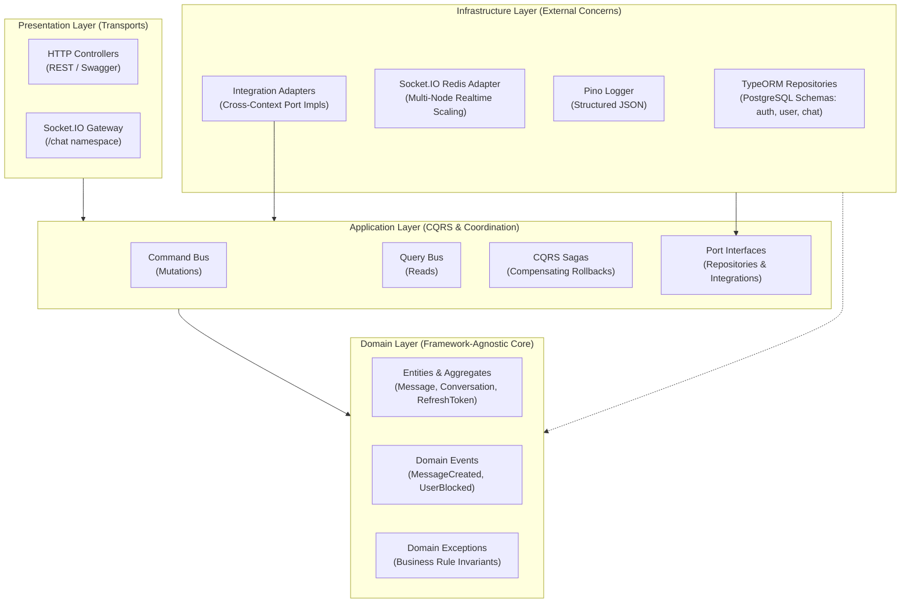

# Chatterbox

Scalable real-time messaging platform built with NestJS, implementing strict Domain-Driven Design (DDD), Clean Architecture, and Hexagonal Architecture (Ports and Adapters).

---

## Table of Contents

- [Overview](#overview)
- [Architecture & Design Principles](#architecture--design-principles)
  - [Architectural Layers](#architectural-layers)
  - [Bounded Contexts](#bounded-contexts)
  - [Hexagonal Integration (Ports & Adapters)](#hexagonal-integration-ports--adapters)
  - [CQRS & Event-Driven Workflows](#cqrs--event-driven-workflows)
  - [Multi-Device Real-Time Sync](#multi-device-real-time-sync)
- [Tech Stack](#tech-stack)
- [Features](#features)
- [Prerequisites](#prerequisites)
- [Getting Started](#getting-started)
  - [1. Clone Repository](#1-clone-repository)
  - [2. Install Dependencies](#2-install-dependencies)
  - [3. Environment Configuration](#3-environment-configuration)
  - [4. Generate RSA Authentication Keys](#4-generate-rsa-authentication-keys)
  - [5. Run Database Migrations](#5-run-database-migrations)
- [Running the Application](#running-the-application)
  - [Using Docker Compose (Recommended)](#using-docker-compose-recommended)
  - [Running Locally](#running-locally)
- [API Reference](#api-reference)
  - [REST Endpoints](#rest-endpoints)
  - [Swagger Documentation](#swagger-documentation)
- [WebSocket Protocol](#websocket-protocol)
  - [Connection & Handshake](#connection--handshake)
  - [Client-to-Server Events](#client-to-server-events)
  - [Server-to-Client Events](#server-to-client-events)
- [Database & Migrations](#database--migrations)
- [Testing](#testing)
- [Project Structure](#project-structure)
- [Environment Variables](#environment-variables)
- [Roadmap](#roadmap)
- [License](#license)

---

## Overview

Chatterbox is a backend messaging service engineered to demonstrate modern enterprise software patterns in NestJS. It models a production-ready real-time communication system featuring multi-instance WebSocket horizontal scaling, RSA-based asymmetric JWT authentication with replay detection, CQRS with compensating transactional sagas, and strict domain isolation across bounded contexts.

---

## Architecture & Design Principles



### Architectural Layers

Dependencies strictly point inward toward the core domain:

1. **Domain Layer**: Completely isolated from external libraries and `@nestjs/*`. Contains rich business entities, aggregate roots, value objects, domain events, and domain exceptions.
2. **Application Layer**: Contains CQRS Command and Query handlers, Saga orchestrators, event listeners, and outbound interface definitions (Ports).
3. **Infrastructure Layer**: Implements technical concerns such as PostgreSQL persistence (TypeORM), Redis pub/sub adapters, Pino logging, and concrete cross-module adapters.
4. **Presentation Layer**: Exposes transport interfaces (HTTP REST controllers, Socket.IO WebSockets), DTO validation, and transport-level guards.

### Bounded Contexts

The application is modularized by business capability rather than technical layers:

- **`auth`**: Manages credential verification, RSA key signing/verification, refresh token rotation, replay detection, and session invalidation.
- **`user`**: Handles user identity, profiles, and user-to-user blocking relationships.
- **`chat`**: Manages direct conversations, message creation, read tracking, unread counters, and real-time delivery.

### Hexagonal Integration (Ports & Adapters)

Modules never directly import internal services, database entities, or repositories from another module. All inter-context operations pass through explicitly defined interfaces (Ports) and adapters:

- `src/modules/chat` invokes `UserIntegrationPort` to verify users and block status. The concrete `UserIntegrationAdapter` fulfills this contract via CQRS queries (`GetUserByIdQuery`, `GetBlockStatusQuery`).
- `src/modules/auth` delegates user creation and password validation through `UserIntegrationPort`.

### CQRS & Event-Driven Workflows

Commands (write operations) and Queries (read operations) are separated via `@nestjs/cqrs`. State modifications trigger Domain Events:
- `MessageCreatedDomainEvent`: Broadcasts outgoing messages to connected WebSocket clients via Redis pub/sub.
- `SignupFailedEvent`: Handled by `AuthSaga` to execute compensating transactions (`DeleteUserCommand`) ensuring cross-context data integrity.

### Multi-Device Real-Time Sync

WebSocket connections are authenticated into per-user rooms (`user-<userId>`). Outgoing messages, message edits, new conversation creations, and read receipts are broadcast to both the recipient and the sender's user room, enabling real-time synchronization across multiple devices and open browser tabs.

---

## Tech Stack

- **Runtime**: Node.js 20+ / 24 LTS
- **Framework**: [NestJS 11](https://nestjs.com/)
- **Language**: TypeScript (ES2022 target)
- **Package Manager**: [Yarn v4 (Berry)](https://yarnpkg.com/)
- **Database**: [PostgreSQL 15+](https://www.postgresql.org/) with multi-schema architecture (`auth`, `user`, `chat`)
- **ORM & Migrations**: [TypeORM](https://typeorm.io/)
- **Caching & WebSocket Scaling**: [Redis 7+](https://redis.io/) via `ioredis` and `@socket.io/redis-adapter`
- **Real-Time Transport**: [Socket.IO 4](https://socket.io/)
- **Authentication**: Asymmetric RS256 JWTs (RSA 2048-bit keys) with refresh token rotation
- **Logging**: [Pino](https://github.com/pinojs/pino) via `nestjs-pino`
- **Testing**: Jest, Supertest, and [Testcontainers](https://testcontainers.com/) (ephemeral PostgreSQL containers for E2E tests)
- **Validation**: `class-validator`, `class-transformer`, and `zod`

---

## Features

- **Real-Time Direct Messaging**: 1-on-1 conversations with low-latency delivery over Socket.IO.
- **Message Editing with Real-Time Sync**: Senders can edit sent text messages; updates broadcast instantly to all participants and sync across the sender's devices.
- **Multi-Instance Horizontal Scaling**: Redis-backed Socket.IO adapter distributes WebSocket events across container replicas.
- **Multi-Device & Multi-Tab Sync**: Per-user room routing ensures a user's sent messages and read receipts mirror instantly across all active sessions.
- **Read Receipts & Unread Counters**: Message viewing updates `last_seen_message_id` and recalculates unread counts per conversation member.
- **User Blocking with Real-Time Shielding**: Blocked users cannot initiate conversations or exchange messages; block state changes broadcast immediately to update client interfaces.
- **Asymmetric JWT Authentication**: RSA 2048-bit key pairs sign access tokens (short-lived) and refresh tokens (long-lived).
- **Token Rotation & Replay Protection**: Refreshing tokens issues a new pair while invalidating the old token; token reuse detection immediately revokes compromised sessions.
- **Compensating Transactions (Sagas)**: Cross-module failures trigger automated compensation commands.
- **Multi-Schema Database Migrations**: Segregated PostgreSQL schemas maintain boundary hygiene at the storage layer.
- **Containerized E2E Testing**: E2E test suites run against real, isolated PostgreSQL containers via Testcontainers.

---

## Prerequisites

- [Node.js](https://nodejs.org/) (v20.x or v22.x LTS recommended)
- [Yarn](https://yarnpkg.com/) (v4 Berry, enabled via `corepack enable`)
- [OpenSSL](https://www.openssl.org/) (for generating RSA key pairs)
- [Docker](https://www.docker.com/) and [Docker Compose](https://docs.docker.com/compose/) (for containerized setup and E2E tests)

> Note: This project strictly uses Yarn for package management. Do not use npm, pnpm, or bun.

---

## Getting Started

### 1. Clone Repository

```bash
git clone https://github.com/mahdi-vajdi/nestjs-chat.git
cd nestjs-chat
```

### 2. Install Dependencies

Enable Corepack to ensure Yarn Berry v4 is active, then install dependencies:

```bash
corepack enable
yarn install
```

### 3. Environment Configuration

Copy the example environment configuration:

```bash
cp .env.example .env
```

Review `.env` and adjust database credentials or ports if necessary.

### 4. Generate RSA Authentication Keys

The application uses RS256 (asymmetric RSA 2048-bit) keys for JWT signing and verification. Generate them using the Makefile:

```bash
make generate_keys
```

This creates the `keys/` directory containing:
- `keys/access_private.key`
- `keys/access_public.key`
- `keys/refresh_private.key`
- `keys/refresh_public.key`

*Manual OpenSSL alternative:*
```bash
mkdir -p keys
openssl genpkey -algorithm RSA -out keys/access_private.key -pkeyopt rsa_keygen_bits:2048
openssl rsa -pubout -in keys/access_private.key -out keys/access_public.key
openssl genpkey -algorithm RSA -out keys/refresh_private.key -pkeyopt rsa_keygen_bits:2048
openssl rsa -pubout -in keys/refresh_private.key -out keys/refresh_public.key
```

### 5. Run Database Migrations

Ensure your PostgreSQL instance is running and execute:

```bash
yarn migration:run
```

---

## Running the Application

### Using Docker Compose (Recommended)

Docker Compose provisions the application, PostgreSQL, and Redis:

```bash
# Build and start services in the background
docker compose up --build -d

# Run database migrations inside the application container
docker compose exec chatterbox yarn migration:run
```

View logs:
```bash
docker compose logs -f chatterbox
```

Stop services:
```bash
docker compose down
```

### Running Locally

Ensure local PostgreSQL and Redis servers are running, then start the application:

```bash
# Development mode with hot-reload
yarn start:dev

# Production build and run
yarn build
yarn start:prod

# Debug mode
yarn start:debug
```

The application starts on `http://localhost:3000` (or the configured `PORT`).

---

## API Reference

### REST Endpoints

All HTTP endpoints are prefixed and documented via OpenAPI:

| Method | Endpoint | Description | Auth Required |
|---|---|---|---|
| `POST` | `/v1/auth/signup` | Register a new user account and obtain initial tokens | No |
| `POST` | `/v1/auth/signin` | Authenticate using email/username and password | No |
| `POST` | `/v1/auth/refresh` | Rotate refresh token and obtain a new token pair | No |
| `POST` | `/v1/auth/logout` | Revoke refresh token (single device or all devices) | Bearer JWT |
| `POST` | `/user/block` | Block target user by ID | Bearer JWT |
| `DELETE` | `/user/block/:targetUserId` | Unblock a previously blocked user | Bearer JWT |

### Swagger Documentation

Interactive Swagger documentation is available at:

```
http://localhost:3000/swagger
```

---

## WebSocket Protocol

The real-time messaging gateway operates under the `/chat` namespace.

### Connection & Handshake

Clients must supply an access token during the handshake, either via headers or auth options:

```javascript
import { io } from 'socket.io-client';

const socket = io('http://localhost:3000/chat', {
  extraHeaders: {
    Authorization: `Bearer ${accessToken}`,
  },
  // Alternatively:
  // auth: { token: `Bearer ${accessToken}` },
});

socket.on('ready', () => {
  console.log('Connected and authorized');
});

socket.on('error.client', (err) => {
  console.error('Connection error:', err);
});
```

### Client-to-Server Events

Clients emit the following events to interact with the chat service:

| Event | Payload | Description |
|---|---|---|
| `conversation.create` | `{ targetUserId: string, content: string }` | Creates a direct conversation and dispatches the first message. |
| `conversation.list` | `{ page?: number, pageSize?: number, filter?: string, targetUserId?: string }` | Fetches paginated conversations with last message and unread count. |
| `conversation.message.send` | `{ conversationId: string, text: string }` | Sends a text message to an existing conversation. |
| `conversation.message.edit` | `{ conversationId: string, messageId: string, text: string }` | Edits an existing text message sent by the authenticated user. |
| `conversation.message.list` | `{ conversationId: string, page?: number, pageSize?: number }` | Retrieves paginated message history for a conversation. |
| `conversation.message.markSeen` | `{ conversationId: string, messageId: string }` | Updates user's read receipt up to the specified message. |

### Server-to-Client Events

Clients receive the following broadcast and direct events:

| Event | Payload Summary | Description |
|---|---|---|
| `ready` | None | Emitted to connecting socket upon successful authorization. |
| `conversation.created` | Conversation metadata, last message, sender details | Emitted to both sender and recipient user rooms. |
| `conversation.message.sent` | Message ID, content, timestamp, sender info | Emitted to recipient and sender user rooms for sync. |
| `conversation.message.edited` | Message ID, conversation ID, updated content, `editedAt` | Emitted to all participants and sender rooms upon edit. |
| `conversation.message.seen` | `{ conversationId: string, messageId: string }` | Emitted to all conversation participants when messages are read. |
| `user.blocked` | `{ blockerId: string, blockedId: string }` | Emitted to both parties when a block relation is created. |
| `user.unblocked` | `{ blockerId: string, blockedId: string }` | Emitted to both parties when a block relation is removed. |
| `error.server` | `{ statusCode: number, message: string }` | Emitted when an exception occurs during request processing. |

---

## Database & Migrations

Database operations are partitioned across three PostgreSQL schemas:
- `auth`: Stores refresh tokens (`auth.refresh_tokens`).
- `user`: Stores user records (`user.users`) and block entries (`user.user_blocks`).
- `chat`: Stores conversations (`chat.conversations`), members (`chat.conversation_members`), and messages (`chat.messages`, `chat.deleted_messages`).

### Migration Commands

```bash
# Run all pending migrations across all modules
yarn migration:run

# Revert the last applied migration
yarn migration:revert

# Generate migrations for specific bounded contexts
yarn migration:generate:auth
yarn migration:generate:user
yarn migration:generate:chat
```

---

## Testing

The test suite covers unit tests, integration tests, and full E2E tests:

```bash
# Run all unit and integration tests
yarn test

# Run tests in watch mode
yarn test:watch

# Generate code coverage report
yarn test:cov

# Run End-to-End (E2E) tests with Testcontainers
yarn test:e2e
```

> **Note on E2E Tests**: End-to-end tests use Testcontainers to automatically start an isolated PostgreSQL container (`postgres:15-alpine`). Ensure Docker is running locally before executing `yarn test:e2e`.

---

## Project Structure

```
nestjs-chat/
├── src/
│   ├── app.config.ts                     # Root application configuration
│   ├── app.module.ts                     # Root module registering bounded contexts
│   ├── main.ts                           # Application bootstrap and pipeline setup
│   │
│   ├── common/                           # Shared cross-cutting components
│   │   ├── decorators/                   # Parameter decorators (@CurrentUserId)
│   │   ├── domain/                       # Base AggregateRoot and Entity primitives
│   │   ├── exceptions/                   # Base DomainException and HTTP status mapping
│   │   ├── http/                         # Global HTTP exception filters
│   │   ├── pagination/                   # Offset pagination utilities and DTOs
│   │   └── websocket/                    # Base WebSocket gateways, auth guards, filters
│   │
│   ├── infrastructure/                   # Global technical infrastructure
│   │   ├── database/                     # PostgreSQL TypeORM provider and data sources
│   │   ├── http/                         # HTTP server port configuration
│   │   ├── logger/                       # Pino logger module and configuration
│   │   ├── redis/                        # Redis client provider
│   │   └── websocket/                    # Socket.IO Redis adapter configuration
│   │
│   └── modules/                          # Bounded contexts (DDD)
│       ├── auth/                         # Authentication & token lifecycle
│       │   ├── application/              # CQRS commands, queries, sagas, ports
│       │   ├── domain/                   # Pure entities (RefreshToken), exceptions
│       │   ├── infrastructure/           # Adapters, TypeORM repositories, migrations
│       │   └── presentation/             # HTTP controller, guards, DTOs
│       │
│       ├── chat/                         # Direct messaging & conversation management
│       │   ├── application/              # Commands, queries, integration ports
│       │   ├── contracts/                # Cross-module domain events
│       │   ├── domain/                   # Aggregates (Message, Conversation), events
│       │   ├── infrastructure/           # Adapters, TypeORM repositories, migrations
│       │   └── presentation/             # Socket.IO gateway, WS event handlers, DTOs
│       │
│       └── user/                         # User accounts & relationship blocking
│           ├── application/              # Commands, queries, integration ports
│           ├── contracts/                # Cross-module domain events
│           ├── domain/                   # User aggregate, block models, exceptions
│           ├── infrastructure/           # Adapters, TypeORM repositories, migrations
│           └── presentation/             # HTTP controller, guards, DTOs
│
├── test/                                 # End-to-end test suites (Testcontainers)
├── docker-compose.yaml                   # Multi-container orchestration (App, Postgres, Redis)
├── Dockerfile                            # Multi-stage production container build
├── Makefile                              # RSA key management automation
└── package.json                          # Scripts and project dependencies
```

---

## Environment Variables

Configure the following variables in `.env`:

| Variable | Type | Default | Description |
|---|---|---|---|
| `NODE_ENV` | String | `development` | Runtime environment (`development`, `production`, `test`) |
| `DEBUG_MODE` | Boolean | `true` | Enables detailed internal logging |
| `PORT` | Number | `3000` | HTTP port for REST API and Swagger |
| `POSTGRES_HOST` | String | `localhost` | PostgreSQL server hostname |
| `POSTGRES_PORT` | Number | `5432` | PostgreSQL server port |
| `POSTGRES_USERNAME` | String | `postgres` | PostgreSQL username |
| `POSTGRES_PASSWORD` | String | `postgres` | PostgreSQL password |
| `POSTGRES_DATABASE` | String | `chatterbox` | PostgreSQL database name |
| `POSTGRES_SCHEMA` | String | `public` | Default fallback schema |
| `POSTGRES_LOG` | Boolean | `true` | Enables TypeORM SQL query logging |
| `POSTGRES_SLOW_QUERY_LIMIT`| Number | `1000` | Query execution threshold (ms) for slow query warnings |
| `POSTGRES_SSL` | Boolean | `false` | Enables SSL for database connections |
| `POSTGRES_APPLICATION_NAME`| String | `nestjs-chat` | Client identifier registered in PostgreSQL connections |
| `POSTGRES_POOL_SIZE` | Number | `10` | Maximum database connection pool size |
| `REDIS_HOST` | String | `localhost` | Redis server hostname |
| `REDIS_PORT` | Number | `6379` | Redis server port |
| `REDIS_USERNAME` | String | `""` | Redis authentication username (if required) |
| `REDIS_PASSWORD` | String | `""` | Redis authentication password (if required) |
| `WEBSOCKET_PORT` | Number | `3000` | WebSocket server port (co-located with HTTP by default) |
| `LOG_USE_FILE` | Boolean | `false` | Enables logging to disk |
| `LOG_FILE` | String | `logs/app.log`| Output path for log files when `LOG_USE_FILE=true` |
| `LOG_LEVEL` | String | `debug` | Pino log level (`trace`, `debug`, `info`, `warn`, `error`) |
| `AUTH_ACCESS_PUBLIC_KEY_PATH` | String | `keys/access_public.key` | Path to RS256 public key for access tokens |
| `AUTH_ACCESS_PRIVATE_KEY_PATH` | String | `keys/access_private.key` | Path to RS256 private key for access tokens |
| `AUTH_REFRESH_PUBLIC_KEY_PATH` | String | `keys/refresh_public.key` | Path to RS256 public key for refresh tokens |
| `AUTH_REFRESH_PRIVATE_KEY_PATH` | String | `keys/refresh_private.key` | Path to RS256 private key for refresh tokens |

---

## Roadmap

Upcoming features and architectural enhancements are tracked in [ROADMAP.md](./ROADMAP.md), including:
- Group messaging with member roles (`OWNER`, `ADMIN`, `MEMBER`)
- Message editing and message deletion ("delete for me" / "delete for everyone")
- Delivery states (`SENT` -> `DELIVERED` -> `READ`)
- Cursor-based message pagination and offline delta synchronization
- Ephemeral typing indicators and online presence tracking via Redis
- Push notifications (FCM / APNs / Web Push)
- S3-compatible media attachments (images, audio, video, documents)

---

## License

This project is licensed under the [MIT License](./LICENSE).